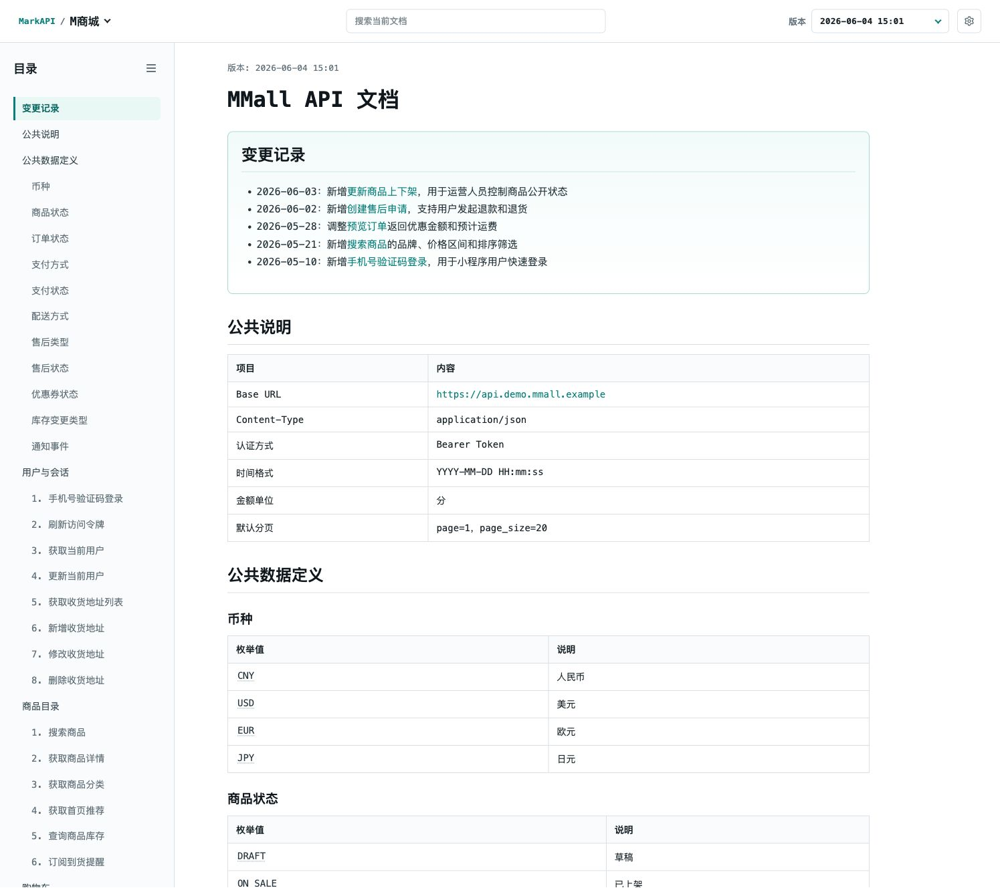

# MarkAPI

[English](README.md) · [在线演示](https://markapi.hxkit.com/zh/docs/ABeyng_ShD-FyzF5PZXGOlYC2rNRpObn)

MarkAPI 是一个面向小团队和内部项目的自托管 Markdown API 文档浏览系统。

你可以上传一份完整的 `.md` 文件，把它发布成带目录、搜索、版本历史和稳定分享链接的只读在线文档页。MarkAPI 刻意保持轻量：它解决 Markdown API 文档的浏览、发布和版本留存问题，不试图替代完整开发者门户或团队协作平台。



## 在线演示

打开只读示例文档：

[MMall API 在线演示](https://markapi.hxkit.com/zh/docs/ABeyng_ShD-FyzF5PZXGOlYC2rNRpObn)

演示站使用样例数据，不提供管理后台试用入口。

## 功能特性

- 自托管部署，数据保存在自己的 SQLite 数据库中
- 适合小团队的单管理员密码后台
- 创建和管理多个文档项目，上传 Markdown 文件生成版本快照
- 通过不可猜的分享链接公开只读文档
- 可选择是否允许访客查看历史版本
- 文档页支持目录、当前文档搜索和版本切换
- 支持 GitHub Flavored Markdown，例如表格、任务列表和代码块
- 自动增强接口文档常见内容，例如接口路径、字段名和 JSON 代码块复制
- 支持中文和英文界面，支持浅色、深色和跟随系统主题
- 支持 Docker Compose 快速启动

## 适合场景

- 团队内部 API 文档浏览
- 给前端、测试、客服或可信协作方提供稳定的只读文档链接
- 保留 Markdown 文档的历史版本
- 在内网或私有服务器上部署轻量文档站

## 不适合场景

- 需要多用户、多角色或细粒度权限控制的文档平台
- 需要公开注册、团队空间和复杂协作流程的 SaaS
- 需要从 OpenAPI 自动生成 SDK 或完整开发者门户的项目
- 需要替代知识库、博客或 CMS 的内容系统

## 快速开始

```bash
cp .env.example .env
```

编辑 `.env`，至少设置：

```env
ADMIN_PASSWORD=replace-with-admin-password
SESSION_SECRET=replace-with-long-random-secret
ALLOW_HTTP_ADMIN_LOGIN=1
```

可以用下面的命令生成 `SESSION_SECRET`：

```bash
openssl rand -hex 32
```

`ALLOW_HTTP_ADMIN_LOGIN=1` 适合本地或临时 HTTP 体验。正式部署到 HTTPS 后，请改为 `ALLOW_HTTP_ADMIN_LOGIN=0`。

`DATABASE_URL` 默认已经指向本地 SQLite 文件，通常不需要修改。

然后启动服务：

```bash
docker compose up -d
```

默认服务地址是：

```text
http://localhost:3000
```

进入后台后，创建项目、上传 Markdown 文档，然后复制项目的分享链接。

Docker Compose 会将数据写入 `markapi-data` volume。正式使用时请定期备份 SQLite 数据库。

## 示例文档

- [MMall API 示例文档（中文）](examples/mmall-api.md)
- [MMall API sample documentation (English)](examples/mmall-api.en.md)

## Markdown 约定

MarkAPI 直接渲染 Markdown 文件，不要求专有格式。

- 支持 GitHub Flavored Markdown，例如表格、任务列表和代码块
- 使用二级标题和三级标题生成文档目录
- `json` 代码块会使用更适合接口文档阅读的展示样式
- 类似 `GET /api/users` 的段落会被识别为接口行
- 表格中的常见字段名、路径和枚举值会提供复制操作

## 配置

| 变量 | 必填 | 说明 |
| --- | --- | --- |
| `ADMIN_PASSWORD` | 是 | 管理后台登录密码 |
| `SESSION_SECRET` | 是 | 会话签名密钥，生产环境必须使用足够长的随机值 |
| `DATABASE_URL` | 否 | SQLite 数据库地址，默认值为 `file:./data/markapi.db` |
| `ALLOW_HTTP_ADMIN_LOGIN` | 否 | 是否允许生产环境下通过 HTTP 登录管理后台 |

默认 `.env.example`：

```env
ADMIN_PASSWORD=replace-with-admin-password
SESSION_SECRET=replace-with-long-random-secret
DATABASE_URL=file:./data/markapi.db
ALLOW_HTTP_ADMIN_LOGIN=1
```

通常不需要修改 `DATABASE_URL`。这个默认值会把 SQLite 数据库放到项目的 `data/` 目录下。如果要自定义相对路径，请保持在 `data/` 目录内，例如 `file:./data/markapi.db` 或 `file:markapi.db`。

## 安全说明

MarkAPI 当前使用单管理员密码模型，适合小团队或内部部署。

公开文档通过不可猜的 `shareToken` 链接访问。它不是登录鉴权系统，拥有链接的人即可访问对应文档。

如果要公开在线演示，请只使用样例数据，并直接链接到只读文档页。不要把管理后台作为公开试用环境。

生产环境建议使用 HTTPS，并设置：

```env
ALLOW_HTTP_ADMIN_LOGIN=0
```

如果必须通过 HTTP 访问管理后台，可以设置：

```env
ALLOW_HTTP_ADMIN_LOGIN=1
```

这会让管理员登录 Cookie 不再强制使用 HTTPS 传输，但登录凭证会通过明文连接传输。只建议在可信内网或临时环境使用。

## 本地开发

```bash
npm install
npm run dev
```

常用检查命令：

```bash
npm run lint
npm run build
```

本项目使用 npm 脚本，不要求 pnpm 或 yarn。

## 技术栈

- [Next.js](https://nextjs.org/) App Router
- [React](https://react.dev/)
- [TypeScript](https://www.typescriptlang.org/)
- [SQLite](https://www.sqlite.org/)

## 项目状态

MarkAPI 目前是早期版本，目标是保持轻量、可自托管、易维护。当前优先服务内部 API 文档浏览场景，不会过早引入复杂权限、团队空间或插件系统。

## 贡献

欢迎提交 issue 和 pull request。提交前请至少运行：

```bash
npm run lint
npm run build
```

请让每个 PR 聚焦一个清晰主题，避免混入无关重构。

## License

[MIT](LICENSE)
